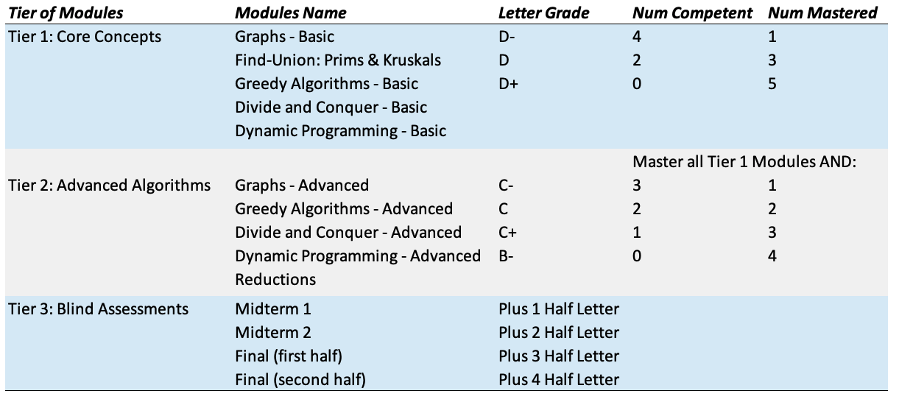

CS2501 - Grading Policy
===============================

[Main Logistics Page](index.html) ([md](index.md))

The grading policy in this course is somewhat unconventional, but you should be familiar with the format from DSA1. This page will attempt to clarify how grades are determined in this course. The course contains 14 **modules**. 10 of these modules are topic based (i.e., there is a topic and associated homeworks/quiz) and 4 of them are blind assessments (two midterm exams and two assessments that together make up the final exam). Each of the 10 topic modules contain the following:

- **homeworks:** The 10 topic-based modules each contain at least one homework assignment. Some are programming assignments while others are written (proofs, problem-sets, etc.).

For each module, your grade will be in one of three states:

- **Incomplete:** The student has not fulfilled the requirements for competency or mastery. This means that it is NOT the case that one homework has been passed.
- **Competency:** The student has passed at least one homework assignment.
- **Mastery:** All homework assignments for this module have been passed. It seems as if you understand this topic.

Aside from the 10 topic-based modules, there are also 4 blind assessment (exam) modules. These are midterm 1, midterm 2, and the final exam (split into two sub-exams but taken at the same time). Each of these exams can only be taken once. However, if passed, the exam will lift your final grade by one half-letter grade (e.g., B to B+). 

**IMPORTANT: PASS/FAIL GRADING INFO:**
The Provost has declared that there are now multiple grading options. They are summarized below:

- **Letter Grade:** Standard grading, you will receive a letter grade for the course according to the chart below. Notice that the chart has been updated so there is **NO** C- grade anymore. If you want this option, you must opt-out of the default pass/fail option between April 24 and April 28. 
- **Pass/Fail:** If you choose this option, you will get one of three grades:
	- **Credit (CR):** This means your letter grade, given the chart below, is C or higher.
	- **General Credit (GC):** This means you earned a D- through D+ in the chart below (notice there is no C- option).
	- **Fail (F):** You did not earn a D- or above.

The letter grades for the course are determined using the chart below. The modules are split into four tiers (basic topics, advanced topics, theory, and exams). For tiers 1-3, you must master all of the modules in the previous tiers before you can earn the grade in that tier. Tier 4 (the exams) are a seperate category and raise your final grade one half letter grade per passed exam no matter what.

{ width=80% }