CS 3100 (DSA2) Teaching Assistants
===========================

[Back to main page](../readme.html)

<link rel="stylesheet" type="text/css" href="tas.css" />

## Ethan Blaser
[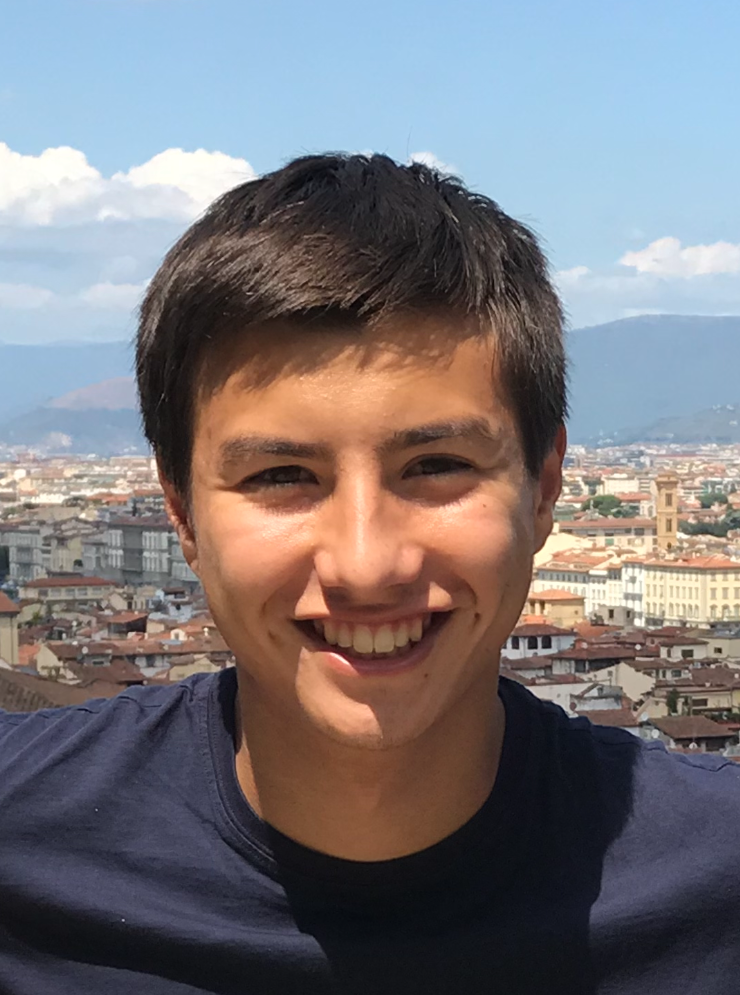](./img/EthanBlaser.png)
Hey everyone, I’m Ethan and I’m the Graduate TA for the course and Head TA for grading. I’m a second year PhD student in CS and former UVA undergrad (Physics and CS). My current research efforts focus on federated learning systems and bandit algorithms (advised by Prof. Hongning Wang). I’ve also had industry experiences at SpaceX and NASA JPL.
 

## Sam Buxbaum
[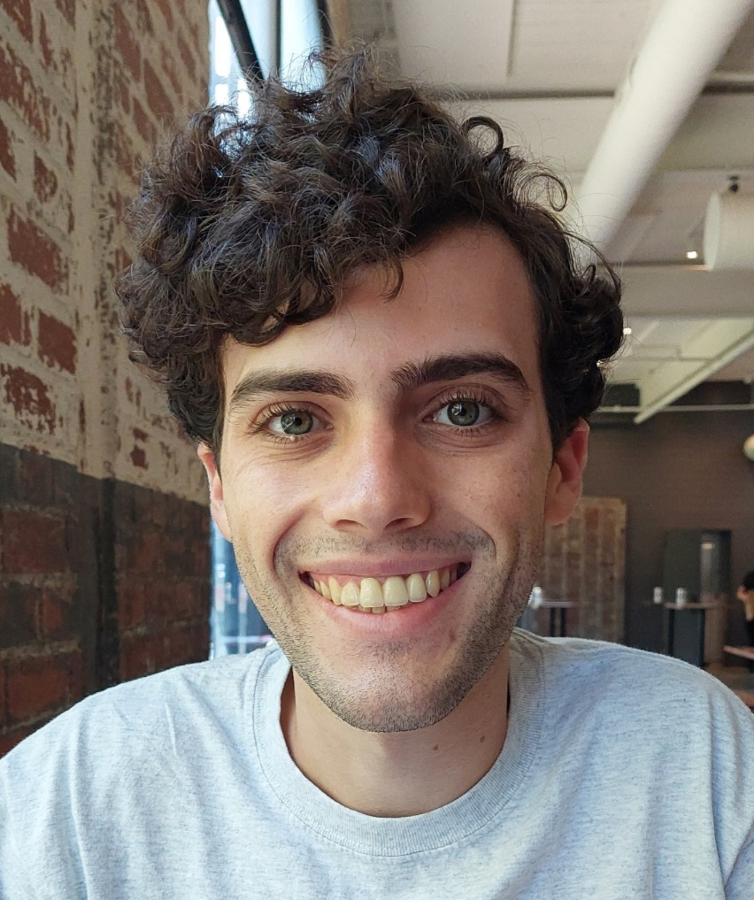](./img/SamBuxbaum.jpg)
I'm a 4th year computer science and physics major. I'm interested in cryptography and sustainable energy. Outside of school, I like to go rock climbing.
 

## Geetanjali Gandhe
[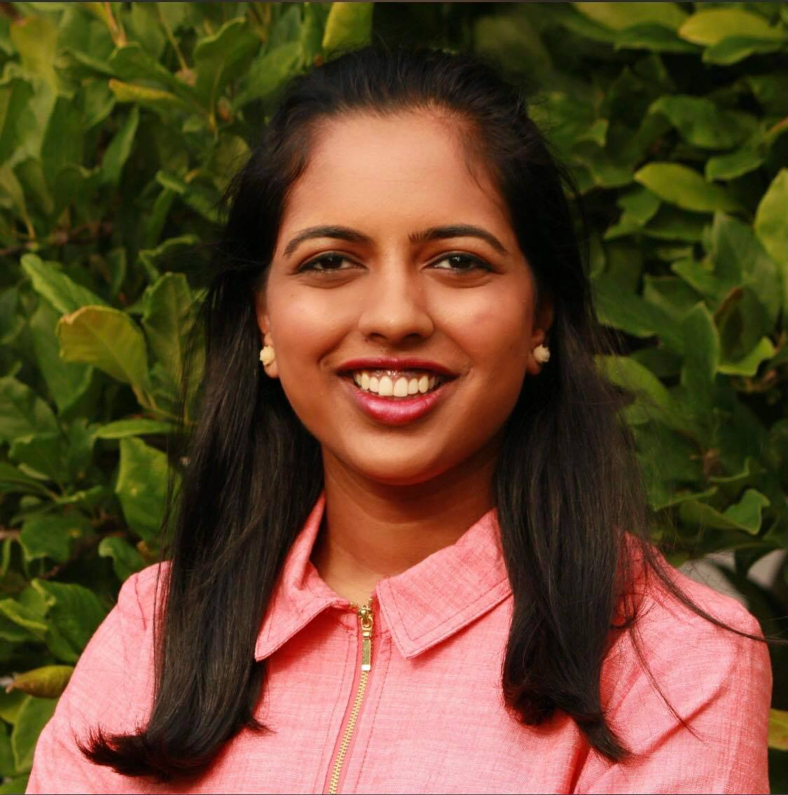](./img/GeetanjaliGandhe.jpg)
Hi! I’m Geetanjali, a fourth-year student from Herndon, Virginia. I am pursuing a double major in Computer Science and Foreign Affairs in the College, with a Japanese minor. In my free time, you can find me in spin class or listening to Ezra Klein’s podcast.
 

## Ethan Gahm
[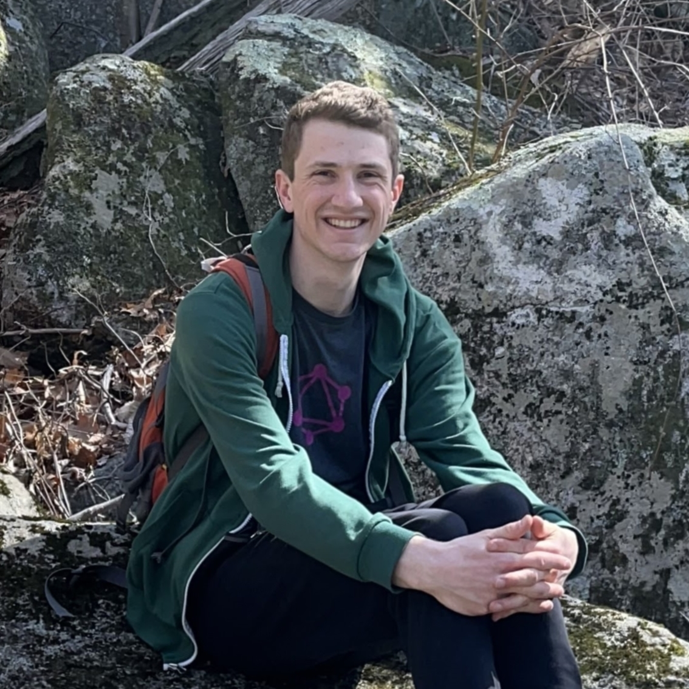](./img/EthanGahm.jpg)
Hey! I’m Ethan, a fourth-year CS major in the engineering school originally from Boston, Massachusetts. I’m a big fan of hiking and running and I dabble a bit in web development. I also play competitive table tennis and I’m a member of the club team here at UVA. This year I’m working as an RA in Brown Residential College.
 

## Yanjin Chen
[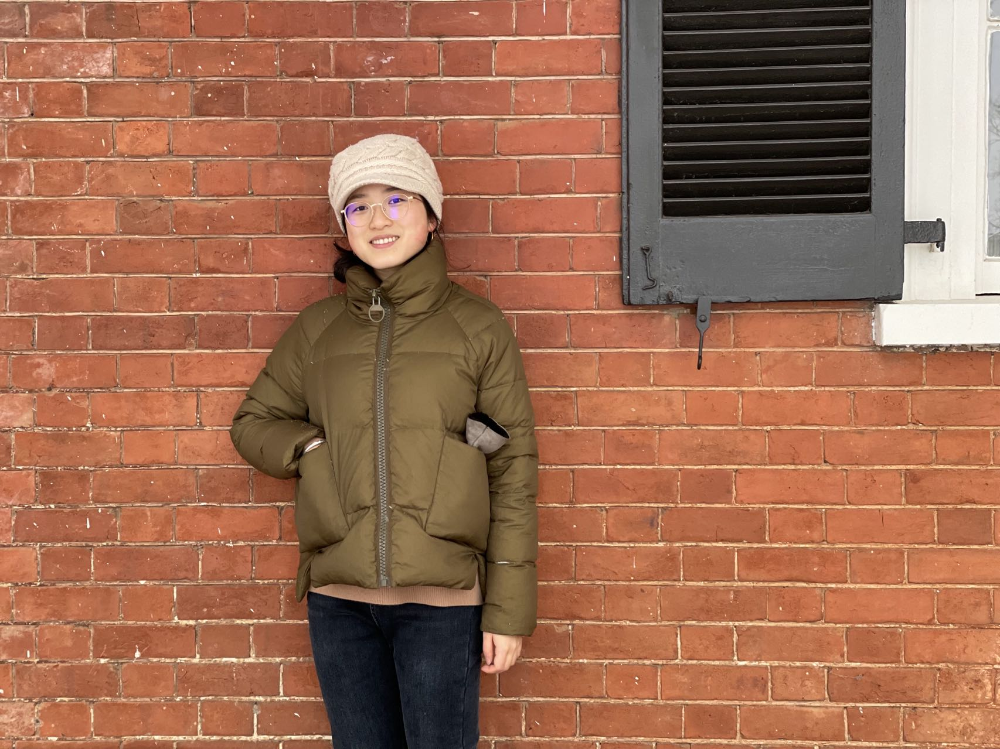](./img/YanjinChen.jpg)
Hello! I’m Yanjin, you can also call me Lucy. I'm a fourth year CS major in the College. I grew up in Nanjing, China (in case you wonder where it is, it’s a fairly big city right next to Shanghai). My interests lie within theoretical research in privacy studies and also bioinformatics. In my free time I enjoy cooking and trying new stuff! I can speak Mandarin,French,and a bit of Japanese so if you wish to discuss problems in those languages with me you are more than welcomed lol.
 

## Jennifer Sheng
[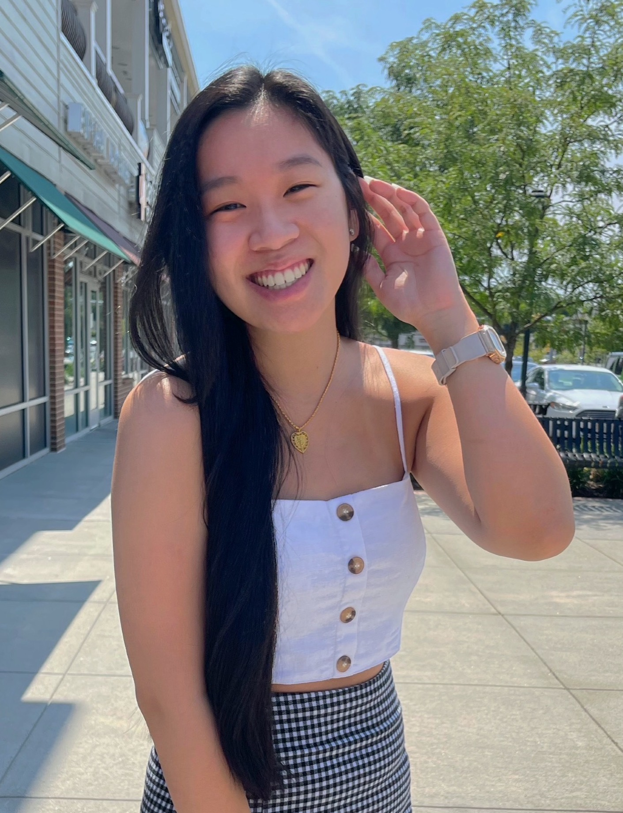](./img/JenniferSheng.jpg)
Hello! My name is Jennifer and I’m currently a fourth year double majoring in Mathematics and Computer Science with a minor in Psychology. I’m from Alexandria, VA (hi from NOVA hehe) and in my free time I enjoy baking, painting, and doing the occasional crossword puzzle.
 

## Kate Armstrong
[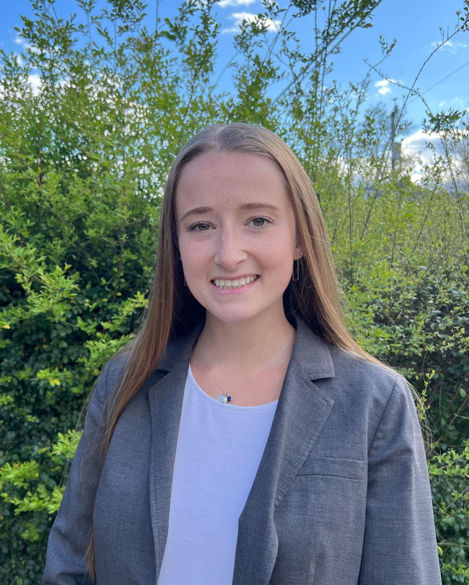](./img/KateArmstrong.jpg)
Hi everyone! My name is Kate and I am a fourth year double majoring in Computer Science and Economics with a minor in Data Analytics. I’m from Westfield, NJ (about 30 mins from NYC) and in my free time I love reading books and binge watching movies with my roommates! (I also love doing the crossword everyday even if I start to cheat past Thursdays:)).
 

## Param Damle
[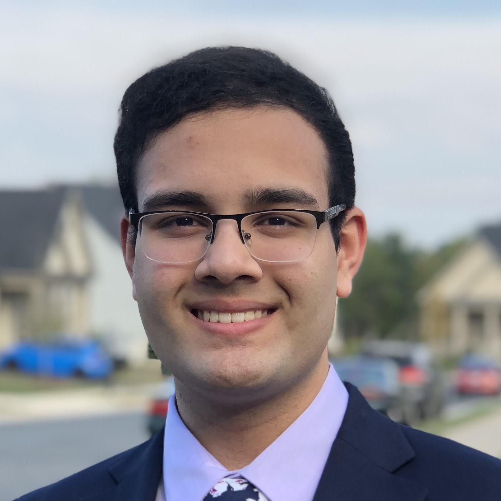](./img/ParamDamle.jpg)
Hey, I’m Param, a third year CS major with minors in Data Science and Engineering Business from Aldie, VA. My main interests in CS include machine learning and algorithmic economics. Outside of school, I enjoy watching YouTube, making visual art, and producing my own music.
 

## Jason Giroux
[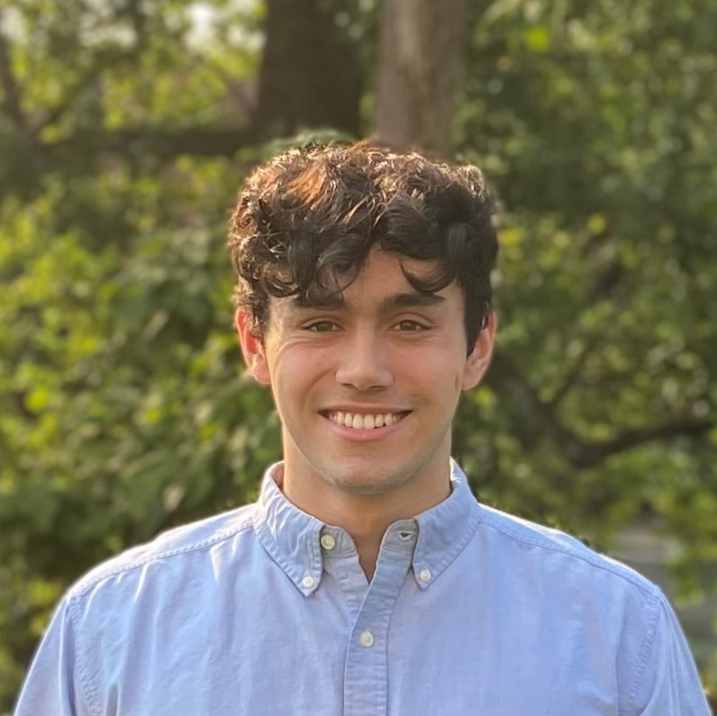](./img/JasonGiroux.jpg)
Hi everyone! My name is Jason, and I’m a third year CS major and Data Science minor in SEAS. Some of my CS-related interests include web development, mobile app development, and machine learning. In my free time I also enjoy hiking Charlottesville’s trails, which are much more interesting than the ones from my hometown of Falls Church, VA.
 

## Jacob Lovelace
[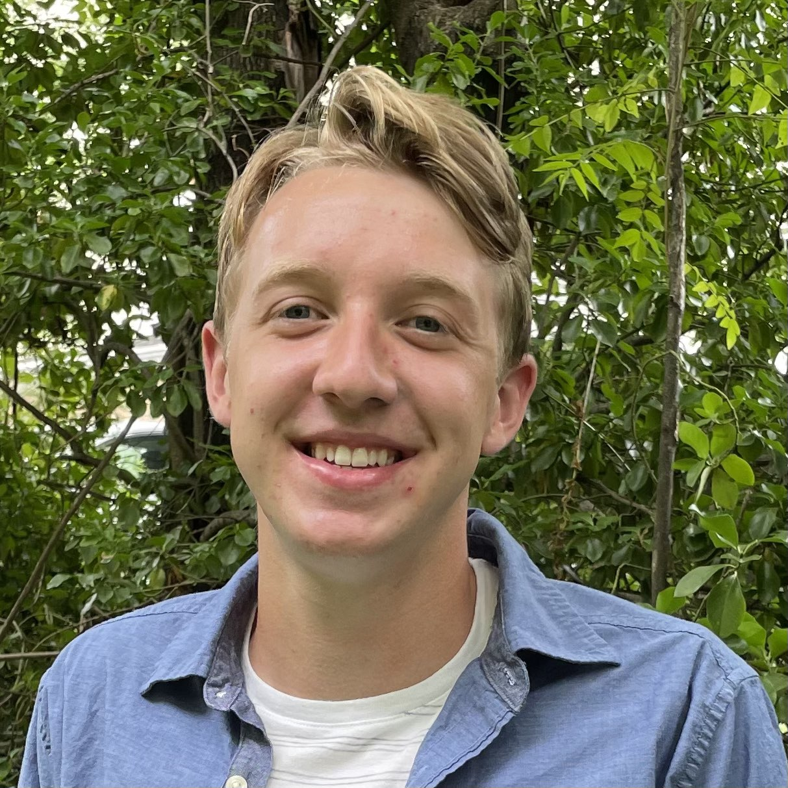](./img/JacobLovelace.png)
Hi! My name's Jacob, and I’m a 4th year BA CS major with a Korean minor. I am a member of the Cavalier Marching Band drumline, and I’m also involved with the UVa Habitat for Humanity club and parkour club. In my free time I like playing tennis and rock climbing.
 

## Evan Rose
[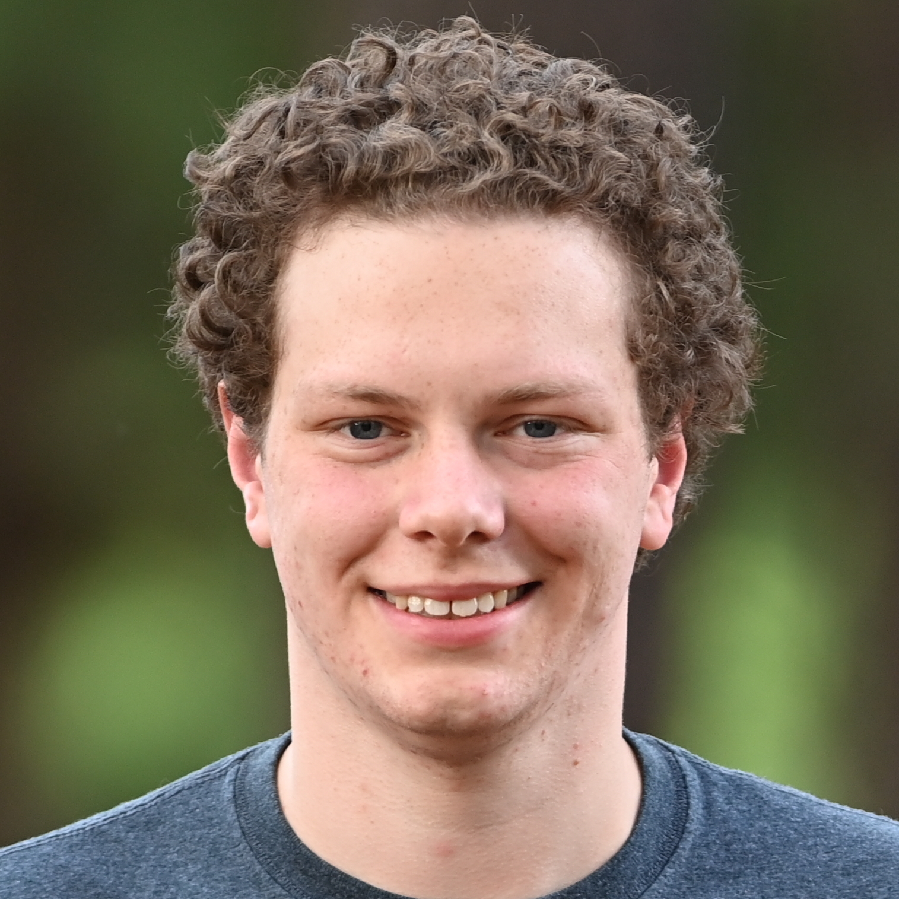](./img/EvanRose.png)
Hi! I'm Evan, a fourth year student majoring in Computer Science and Math. I love helping students learn about the exciting world of algorithms (especially graph algorithms!). In my free time I can be found watching T.V. and going through the music bins at Goodwill.
 

## Henry Todd
[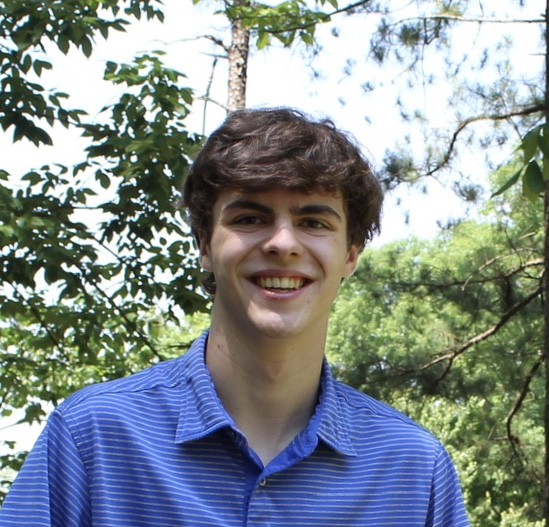](./img/HenryTodd.png)
I was born in Thomasville, GA and grew up in Atlanta. This year I am a fourth year in engineering and majoring in CS with a second major in math. This is my second semester as a TA. I love music, especially going to concerts, hiking and running, gaming of all types, and writing.
 

## Alex Li

Hi, I’m Alex Li a 4th year in the Comm school majoring in CS and Finance. I’m from Wilton, CT and before TAing DSA2 I was a 2150 TA. Outside of school I’m the treasury of my fraternity, I enjoy playing spikeball, hiking, and playing beach volleyball. A fun fact about me is that I can eat a large pizza in 3 and ½ minutes.
 

## Gloria Sun
[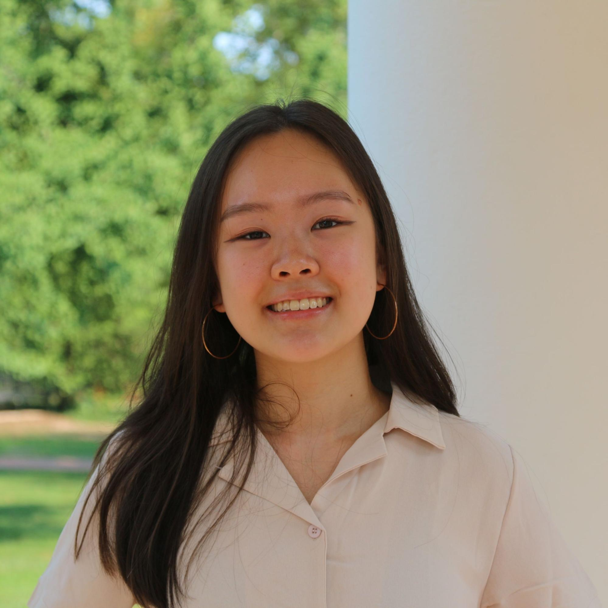](./img/GloriaSun.jpg)
Hi everyone! I’m Gloria, and I’m a third year majoring in CS in the CAS. I’m from Falls Church, VA and I love to dance to hip-hop/r&b, read, and play chess. Always down to be friends and tackle hackathons together!
 

## Shreya Nagabhirava
[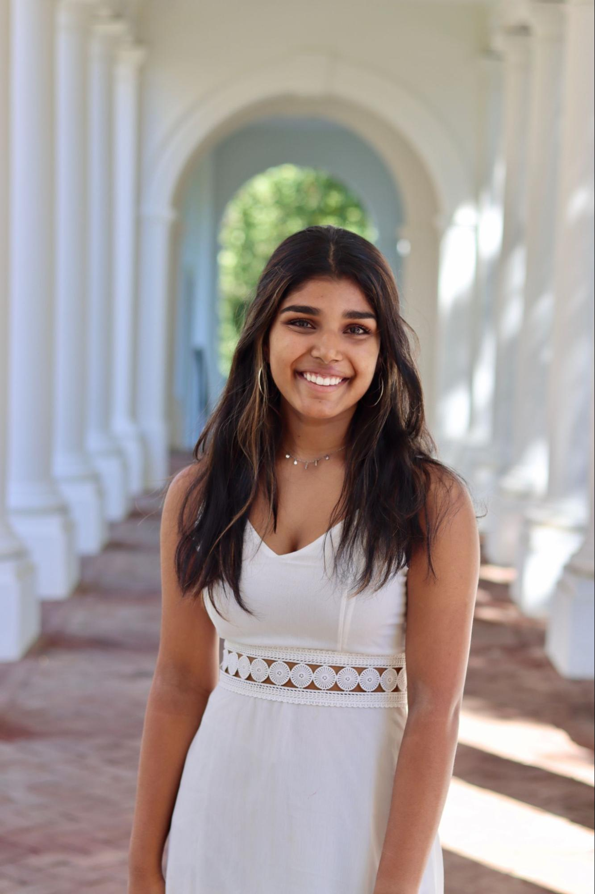](./img/ShreyaNagabhirava.jpg)
Hi! My name is Shreya, and I’m a third year majoring in CS with a minor in Data Science in the College. I love to sing, dance, and play instruments, and I am actually part of a dance team and an a cappella group at UVA!
 

## Nitin Maddi
[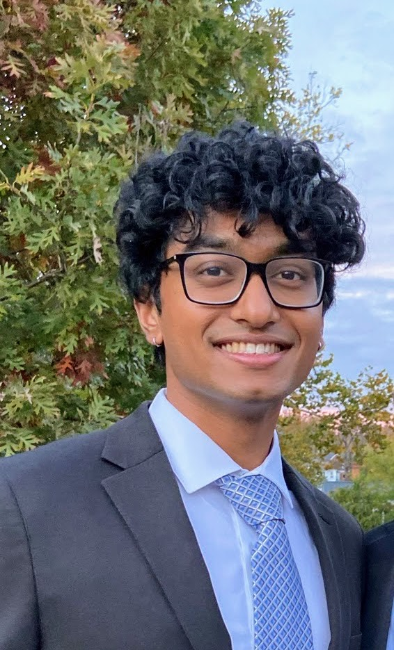](./img/NitinMaddi.jpg)
Hi! My name is Nitin and I’m a 4th year majoring in CS. I was born and raised in Fairfax, VA. My favorite parts of CS are artificial intelligence, machine learning, and cryptocurrency.  Outside of school, I love playing tennis, watching movies, gaming, and lifting.
 

## Walker Pollard

Hi! My name is Walker, I am a 4th year double majoring in CS and Econ. I am from Bedford, VA, in the heart of the Blue Ridge Mountains. I love the outdoors, playing sports, and watching comedies. Outside of school, I am involved in the Catholic Hoos student ministry.
 

## TAs with no bio yet (but hopefully soon)

- Medha Boddu
- Arnav Chandra
- Mark Haas
- Rishabh Jain
- Joseph Larson
- Talia Miller
- Steven Myung
- Hien Nguyen
- Katie Nguyen
- Connor Noble
- Emma Ritchie
- Zachary Russell
- Hanzhang Zhao
- Yancheng Zhou

